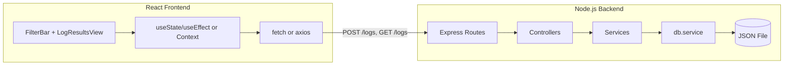

# Log Ingestion and Querying System – Implementation Plan

## Architecture Overview




Backend follows **Controller → Service → DB Service**: controllers handle HTTP only; services contain all filtering/validation logic; `db.service` performs all file read/write.

---

## Part 1: Project Structure

**Repository layout (single repo):**

```
Evallo-ai/
├── backend/           # Node.js + Express
│   ├── src/
│   │   ├── controllers/
│   │   ├── services/
│   │   ├── routes/
│   │   ├── config/
│   │   └── utils/
│   ├── data/
│   │   └── logs.json   # persistence (create if missing)
│   ├── package.json
│   └── README.md (optional; root README is primary)
├── frontend/          # React (Vite or CRA)
│   ├── src/
│   │   ├── components/
│   │   ├── hooks/
│   │   ├── services/
│   │   └── ...
│   └── package.json
└── README.md          # Required: overview, setup, run, design decisions
```

- **Backend:** `backend/` with Express, no external DB.
- **Frontend:** `frontend/` with React (Vite recommended for speed).
- **Root README.md:** Must include project overview, install/run for both apps, and design decisions (per assessment).

---

## Part 2: Backend Implementation

### 2.1 Data persistence (db.service)

- **Storage:** Single JSON file (e.g. `backend/data/logs.json`) holding an array of log objects.
- **Allowed:** `fs` (readFile/writeFile) or a thin wrapper like `node-json-db`. No MongoDB, PostgreSQL, or cloud DBs.
- **db.service responsibilities only:**
  - `readLogs()` → read file, return array (or `[]` if file missing/empty).
  - `appendLog(log)` → read, push one log, write back.
  - Optionally: create file if not exist, handle read/write errors (throw or return error for services to handle).
- **No business logic here:** no filtering, validation, or sorting in db.service.

### 2.2 Log schema and validation

- **Schema (all required):**
  - `level`: string, one of `"error"` | `"warn"` | `"info"` | `"debug"`.
  - `message`: string.
  - `resourceId`: string.
  - `timestamp`: string, ISO 8601 (e.g. `2023-09-15T08:00:00Z`).
  - `traceId`: string.
  - `spanId`: string.
  - `commit`: string.
  - `metadata`: object (can be `{}`).
- **Validation:** In a **service** (e.g. `log.service` or `validation` helper), validate type and required fields; validate `level` enum and optionally `timestamp` format. Reject invalid payloads with clear messages.

### 2.3 API contract


| Method | Path  | Purpose                                                                                                                                                                                                                                                                                 |
| ------ | ----- | --------------------------------------------------------------------------------------------------------------------------------------------------------------------------------------------------------------------------------------------------------------------------------------- |
| POST   | /logs | Ingest one log (body = one JSON object). Respond 201 + stored log; 400 if invalid; 500 on server/file errors.                                                                                                                                                                           |
| GET    | /logs | Query logs. Query params (all optional): `level`, `message`, `resourceId`, `timestamp_start`, `timestamp_end`, `traceId`, `spanId`, `commit`. All filters combined with AND. Response: JSON array, reverse chronological by `timestamp`. Empty array if no match. 500 on server errors. |


- **CORS:** Enable for frontend origin (e.g. `http://localhost:5173` when using Vite).

### 2.4 Controller → Service → DB flow

- **Controllers:**
  - Parse `req.body` (POST) or `req.query` (GET).
  - Call one service method each (e.g. `logService.ingest(body)`, `logService.query(filters)`).
  - Map success/errors to status codes (201/200/400/500) and send JSON. No business logic or DB calls in controllers.
- **Services:**
  - **Ingest:** Validate body against schema; if valid, call `dbService.appendLog(log)`; return stored log; throw on validation failure.
  - **Query:** Accept filter object (level, message, resourceId, timestamp_start, timestamp_end, etc.). Call `dbService.readLogs()`; in service, apply all filters (AND) and sort by `timestamp` descending; return array.
- **Filtering logic (in service):**
  - **message:** case-insensitive substring match (e.g. `log.message.toLowerCase().includes(query.message.toLowerCase())`).
  - **level:** exact match (after normalizing if needed).
  - **resourceId:** exact or substring per spec (spec says “typing into a text field” – implement at least substring/case-insensitive for UX).
  - **timestamp_start / timestamp_end:** compare `log.timestamp` as dates; include logs where `timestamp >= start` and `timestamp <= end`.
  - **traceId, spanId, commit:** exact or substring match as specified.
  - Combine all present filters with AND.

### 2.5 Error handling and quality

- Use try/catch in controllers; return 400 for validation errors, 500 for unexpected errors.
- No business logic in controllers; no direct DB or `fs` access outside db.service.
- JSDoc on all public functions; no hardcoded URLs/ports (use `config` or env); no `console.log` in production paths (use a logger if desired).

---

## Part 3: Frontend Implementation

### 3.0 React best practices (skills file)

When writing or reviewing the React frontend, follow the project’s React best-practices skill so the UI stays performant and maintainable.

- **Skills file:** [SKILL.md](Evallo ai/SKILL.md) — *Vercel React Best Practices* (when to apply, rule categories, quick reference).
- **Rule files:** [rules/](Evallo ai/rules) — 57 rules in 8 categories (async, bundle, server, client, rerender, rendering, js, advanced). Each rule is in its own `.md` file (e.g. `rerender-memo.md`, `client-swr-dedup.md`).

**Relevant for this project:**

- **Client-side data fetching:** `client-swr-dedup`, `client-event-listeners` — e.g. deduplicate GET /logs calls, avoid redundant requests when filters change.
- **Re-render optimization:** `rerender-defer-reads`, `rerender-derived-state-no-effect`, `rerender-memo` — keep filter state and log list updates efficient; avoid subscribing to state only used in callbacks; derive values during render where possible.
- **Rendering:** `rendering-conditional-render`, `rendering-usetransition-loading` — conditional loading/error UI; optional use of transitions for loading states.
- **JS performance:** `js-cache-function-results`, `js-length-check-first` — optional micro-optimizations in filter/search logic.

**Responsive and better UI (apply [SKILL.md](Evallo ai/SKILL.md) and [rules/](Evallo ai/rules) when building layout and components):**

- **Long list performance / responsiveness:** `rendering-content-visibility` — use CSS `content-visibility: auto` on log list items so off-screen rows don’t block layout/paint; keeps scrolling smooth and the UI responsive with many logs.
- **Loading state and responsiveness:** `rendering-usetransition-loading` — use `useTransition` for filter/search updates so the UI stays responsive during refetches; `rerender-transitions` for frequent updates (e.g. typing in search) so the main thread isn’t blocked.
- **Cleaner UI structure:** `rendering-hoist-jsx` — hoist loading skeleton or repeated JSX (e.g. log row placeholder) to avoid unnecessary re-creation and keep the component tree clear.
- **Avoid layout thrashing:** `js-batch-dom-css` — if measuring elements or animating (e.g. filter bar, log row height), batch layout reads and style writes to prevent forced reflows and keep the UI smooth.
- **Conditional and scannable UI:** `rendering-conditional-render` — use early returns for loading/error states so the main log list only renders when data is ready; keeps the layout predictable and easier to scan.

During implementation, read [SKILL.md](Evallo ai/SKILL.md) first for context, then consult the specific rule files in [rules/](Evallo ai/rules) when implementing data fetching, state updates, list rendering, **and responsive/better UI** (layout, loading, long list, transitions).

### 3.1 Setup and tech

- React with functional components and hooks (`useState`, `useEffect`).
- State: component state and/or Context; Redux/MobX not required.
- API: `fetch` or `axios`; base URL from env (e.g. `VITE_API_URL` for Vite).
- One logical place for API calls: e.g. `frontend/src/services/api.js` (or `logApi.js`).

### 3.2 UI components

When implementing these components, apply the [SKILL.md](Evallo ai/SKILL.md) and [rules/](Evallo ai/rules) guidance for **responsive and better UI** (see section 3.0: content-visibility for the log list, useTransition/transitions for loading and filter updates, hoist JSX, batch DOM/CSS, conditional render).

1. **Filter bar (top of page)**
  - Text input: full-text search on **message** (will drive `message` query param).
  - Dropdown or multi-select: **level** (error, warn, info, debug).
  - Text input: **resourceId**.
  - Two date/time inputs: **timestamp start** and **timestamp end** (map to `timestamp_start`, `timestamp_end` in ISO 8601).
  - Optional: “Clear filters” button.
  - **Behavior:** When user changes any filter, update state and refetch (GET /logs with query params). Optionally debounce the message search (e.g. 300–400 ms) to limit requests while typing.
2. **Log results view**
  - List or table of log entries (reverse chronological).
  - Each row/card: level, message, resourceId, timestamp, traceId, spanId, commit, metadata (e.g. collapsed or tooltip).
  - **Visual cues by level:** e.g. error = red left border or light red background; warn = yellow; info = blue or gray; debug = gray. Keeps UX scannable.
3. **Loading and errors**
  - Loading indicator while GET /logs is in flight.
  - Simple error state if request fails (e.g. toast or inline message).

### 3.3 Data flow

- **State:** Filter values (message, level, resourceId, startTime, endTime) + list of logs + loading/error.
- **Effect:** When filter state changes, call GET /logs with current params; update logs state (and loading/error).
- **Ingestion (optional for demo):** Small form or button to POST a sample log (or use curl/Postman for assessment). Not strictly required by UI stories but helpful for testing.

### 3.4 Responsiveness and structure

- **Layout:** Should not break on typical desktop widths; full mobile responsiveness is optional. Use [SKILL.md](Evallo ai/SKILL.md) and [rules/](Evallo ai/rules) to keep the UI responsive and polished: e.g. `rendering-content-visibility` for the log list, `rendering-usetransition-loading` and `rerender-transitions` for responsive loading and filter updates, `js-batch-dom-css` if doing any layout-dependent styling or animation.
- **Component structure:** Organize by concern: e.g. `components/FilterBar.jsx`, `components/LogList.jsx`, `components/LogEntry.jsx`, `hooks/useLogs.js` (or similar), `services/api.js`.

---

## Part 4: README and Submission

- **Root README.md must include:**
  - Brief overview of the project and approach.
  - Step-by-step: install dependencies for backend and frontend.
  - How to run backend server and frontend dev server (with ports, e.g. backend 3000, frontend 5173).
  - Design decisions: e.g. why JSON file, why Vite, choice of persistence helper (fs vs node-json-db), optional debounce/state structure.
- **Submission:** One Git repo; root README; public repo link (or access for evaluators).

---

## Part 5: Optional Bonuses (if time permits)

- **Real-time:** WebSocket on server; on POST /logs success, push new log to connected clients; frontend subscribes and appends to list.
- **Analytics:** Small dashboard (e.g. Chart.js/Recharts) with log count by level for the currently filtered time range.
- **Docker:** `Dockerfile` for backend and for frontend (build + serve), plus `docker-compose.yml` to run both with `docker-compose up`.
- **Unit tests:** e.g. Jest for backend filtering function (multiple filter combinations, edge cases).

---

## Implementation Order (suggested)

1. Backend: project init, db.service (read/write JSON), log schema validation.
2. Backend: log.service (ingest + query with all filters and sort), log.controller, routes, CORS.
3. Test backend with curl/Postman (POST log, GET with various filters).
4. Frontend: init, API service, FilterBar and LogList/LogEntry, state and useEffect for GET /logs. Apply React best practices from [SKILL.md](Evallo ai/SKILL.md) and [rules/](Evallo ai/rules) (client fetching, rerender, rendering).
5. Frontend: level styling, loading/error, optional debounce and clear filters. Apply [SKILL.md](Evallo ai/SKILL.md) and [rules/](Evallo ai/rules) for responsive and better UI (content-visibility on log list, useTransition/transitions for loading and filter updates, hoist JSX, conditional render).
6. Root README: setup, run, design decisions.
7. (Optional) Bonuses: WebSocket, chart, Docker, tests.

---

## Checklist vs Assessment Criteria

- **Backend:** POST /logs and GET /logs with correct status codes; validation; filtering by level, message, resourceId, timestamp range, and others; combined AND logic; reverse chronological order; JSON file only.
- **Frontend:** All filters present and wired; full-text search on message; results update (with or without debounce); level-based visual cues; clean, understandable layout.
- **Code quality:** Controller → Service → DB Service; no business logic in controllers; no direct DB outside db.service; clear structure; error handling; JSDoc.
- **Persistence:** Single JSON file; read on startup; write on ingest; no external DB.
- **Documentation:** README with overview, install, run, and design/trade-offs.

This plan aligns with the assessment PDF and with your Attack Capital coding standards (Controller → Service → DB Service, logic in services, DB only in db.service).